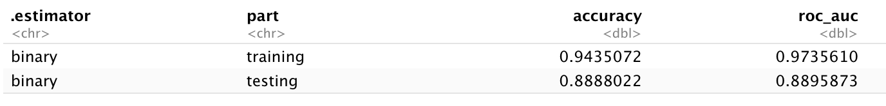
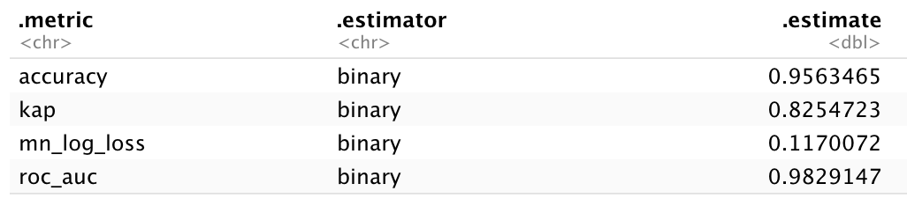
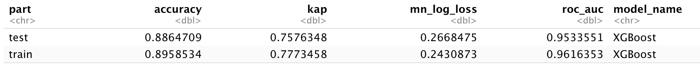

<h1 align="center">Kyle Phillips' Portfolio</h1>
<h2 align="center">Data Science/Data Analysis</h2>

# [Project 1: Wake Forest Baseball Team Predictive Umpire Accuracy Model in R](https://github.com/edward1321/CorrectCall_XGBoost_Model)
- Used "TrackMan" ball flight metrics from SEC and ACC games over the last 4 years
- Was tasked by the coaching staff to create an expected umpire accuracy model
- The model outputs the probability of a correctly called pitch
- The mean of all pitches is the overall expected accuracy and is then compared to the actual accuracy as the difference
- The model is used for pre-game and post-game scouting reports on umpires
- Created a logistic regression, random forest, KNN, and XGBoost model
- Choose the XGBoost model due to performance and simplicity over other models

**The final XGBoost model operates at about 89% accuracy.**

# [Project 2: Machine Learing Loan Status Project in R](https://github.com/edward1321/LoanStatus_FinalProject)
- Within my graduate machine learning class, our final project was to act a consultant for a fictional financial institution
- Tasked with building several machine learning models to predict loan status on customers and identify the most important factors
- Given a training(∼30,000 rows) and holdout set(∼13,000 rows) to first build the model and then predict on the holdout set
- Data cleaning, transforming, and exploratory analysis was done on the target varibale before the models were created
- A full and redcued logistic regression, random forest, and XGBoost model were created and compared
- The reduced XGBoost model was choosen based on perfomance and simplicity
- The detailed technical steps and executive summary detailing the project are also included in the repository

**The final XGBoost model operates at about 96% accuracy, significantly higher than the other models tested.**

# [Project 3: Wake Forest Baseball Team Predictive Swing Modeling Project in R](https://github.com/edward1321/XGBoost_Swing_Model)
- Used "TrackMan" ball flight metrics from SEC and ACC games over the last 4 years
- Created a logistic regression, random forest, and XGBoost model
- Choose XGBoost as the final model based on performance and simplicity over other models
- The model is used to calculate a given pitch's probability of warranting a swing
- Used by the coaching staff during bullpen sessions to evaluate a pitcher's performance

**The final XGBoost model operates at about 89% accuracy.**

# [Project 4: Wake Forect Baseball Team Automated Quality At Bat Tracker in R](https://github.com/edward1321/Automated_Quality_At_Bat)
- Used "TrackMan" ball flight metrics from SEC and ACC games over the last 4 years
- Wrote code to automate how the coaching staff tracks quality at bats in games and scrimmages
- A binary variable will be outputted to the calculate a quality at bat percentage
- The percentage for each player is then used in the team's R Shiny app for player evaluation

# [Project 5: Wake Forest Baseball Team Automated Pitch Classifier in R](https://github.com/edward1321/Pitch_Classification)
- Used "TrackMan" ball flight metrics from SEC and ACC games over the last 4 years
- Wrote code to automate how a pitch is classified based on several ball flight metrics
- The new variable used within several models created by the team for pitching value purposes
- Code was needed due to insufficient classification by away teams, and is a fool proof way of classifying pitches
